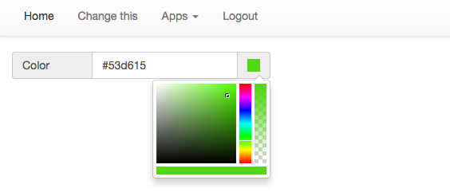
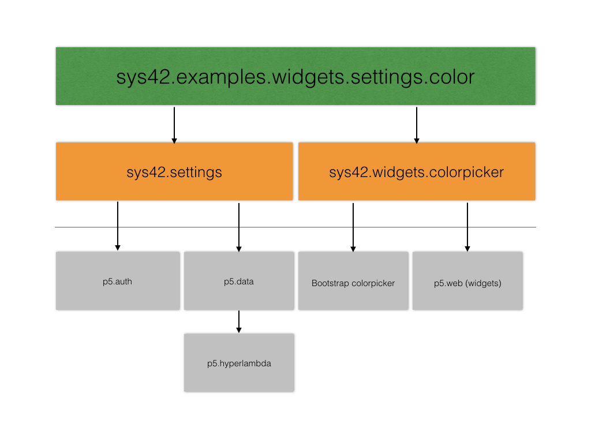
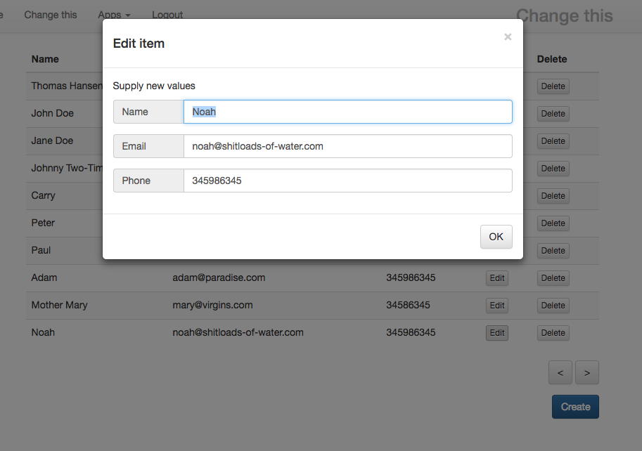
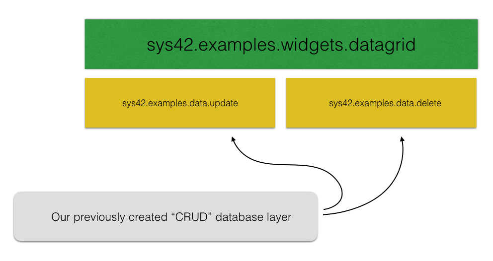

# Reusable GUI components

In this chapter, we will bring the component approach from our previous chapter even further, and create reusable GUI components. In our previous chapter, we created a completely generic CRUD database layer, with support for all four CRUD operations. In this chapter, we will take a look at reusable custom widgets.

So far, we have only used the core widgets. However, to create a custom and more complex widget in Hyperlambda, is actually surprisingly easy. As always, the answer is to create an Active Event. Execute the following code in your Executer.

```
create-event:sys42.examples.widgets.foo
  return
    container
      class:col-xs-12
      widgets
        literal
          innerValue:Hello world!
        literal
          innerValue:Hello even more dear world!
```

The above is actually a custom widget. To consume it, is equally simple. Create a new lambda page, and paste in the following code.

```
create-widget
  widgets
    sys42.examples.widgets.foo
```

The above should result in a simple **[container]** widget, containing two **[literal]** widgets. Anywhere you can use a **[literal]**, **[container]** or **[void]** widget, you can also use your custom extension widget.

An Active Event that is an extension widget, needs to return exactly one widget. This widget can of course be a **[container]** type of widget though, which allows us to create any amount of internal complexity within it as we wish. The above widget, is probably not that useful. However, since Active Events can be parametrized, changing our lambda object as it executes - We can parametrize our custom widgets, any ways we see fit.

## Your first useful and reusable widget

Below we create a colorpicker settings widget, that automatically persists changes to its settings value, to the database for your app.

```
/*
 * Creates a colorpicker widget, which is automatically 
 * "databound" to a setting value.
 * Pass in [setting], [app], [text], and [title].
 */
create-event:sys42.examples.widgets.settings.color

  // Retrieving setting value.
  eval-x:x:/+/*
  sys42.settings.get:x:/../*/setting?value
    app:x:/../*/app?value

  // Forward evaluating arguments.
  eval-x:x:/+/**(/label|/title|/value|/sys42.settings.set|/app)

  // Returning colorpicker to caller.
  return
    container
      class:x:/../*/class?value
      widgets
        sys42.widgets.colorpicker
          label:x:/../*/text?value
          class:input-group colorpicker-component colorpicker-element
          title:x:/../*/title?value
          value:x:/../*/sys42.settings.get/*?value
          .onchange

            /*
             * Changing setting to whatever color was selected.
             */
            eval-x:x:/+/*
            sys42.settings.set:x:/../*/setting?value
              app:x:/../*/app?value
              src:x:/../*/value?value
```

If you execute the above code in your Executor, for then to create a lambda CMS page, with the following content - You can see it in action.

```
create-widget
  class:col-xs-3
  widgets
    sys42.examples.widgets.settings.color
      setting:some-color
      app:my-app
      text:Color
      title:Choose a color for the property please
```

Now the thing to realize, is that the above **[sys42.settings.set]** Active Event, and the **[sys42.settings.get]** Active Event, are helper events from System42. These events allows you to retrieve and update settings values on a per app/user basis. The above extension widget hence, allows you to easily create a widget, for every time you want to change some color setting for your application. Hence, you have created a highly reusable widget, which you can use every time some user wants to change a color setting of some type. The widget itself, will automatically take care of persisting the new setting values to the database.

You can see this, if you change its value, for then to refresh the page. At which point, it will fetch the new value automatically from the database.

Notice also, that the extension widget we created above, internally uses another extension widget, and a couple of helper Active Events, for modifying and creating *"settings"* for your apps. This allows you to create *"layer upon layer of added complexity"*, and build your components up like this, in layers - Always being able to reuse your previously created components, as long as you're a little bit careful, and try to think generically as you create these components.

This allows you to build up your application in layers, almost like an onion. Where every layer, only needs to worry about the layer(s) it is directly using. Everything beneath the layers that your components are using, can be completely ignored. This facilitates for a very strong degree of *"encapsulation"*, where everything within the internals of your components, becomes black box technology, you don't have to worry about.

The above extension widget actually solves all your *"color settings problems"*, for all of your future applications. The widget would resemble something like the following on your page.



To understand the beauty of this design, it might be feasible to create a dependency diagram of how the widget above is internally created, by incrementally building upon previously created components.



In the diagram above, the green part is our widget. The orange parts, are the things our widget needs to have knowledge about. The grey parts are what our component is *indirectly* using. The grey line, is a boundary, that shows what we need to think about, when maintaining our components. Everything below the grey boundary, are things we do not in any ways need to worry about.

## Everything "adapts"

The beauty of this design, is that any single box in our above diagram, can easily be exchanged with any other implementation. For instance, the **[sys42.settings.get/set]** Active Events are using the p5.data component. If we wanted to, we could replace the usage of p5.data, with another component - Storing settings in for instance MySQL or MongoDB.

Another example is p5.auth, which authenticates and authorize users in P5. Although relatively safe and secure, this component is still a little bit naive in its implementation - Particularly in regards to how it handles roles. If you wanted to, you could easily replace the entirety of p5.auth, with your own auth component. As long as you created your new auth component, with Active Events having the same names, taking the same set of arguments, and returning the same set of values - Nothing would break. You basically always have an adapter pattern at your disposal, implicitly implemented on everything you create.

### The adapter pattern

The adapter pattern, is a beautiful design pattern, that allows you to replace parts of your internals, without affecting the outer layers of your system. In P5, this pattern is implicitly given, in everything you do. Hence, in our above solution, we have a total of 8 components, where any single one of these components, can easily be replaced, with any other component - *Without* breaking anything.

This allows you to easily create something, and use it initially, to rapidly get something together for your app - While later, as you become more certain of that you actually need this something, and you want to create it more scalable, secure, feature rich, whatever - You can refactor this something and make it better. This makes sure you'll not have to spend energy on the things that you are not 100% certain of that you'll actually need, as the requirements for your app changes.

I like to use the analogy of LEGO for this, since in P5, everything you do, can be replaced the same way any LEGO brick can be replaced - Because any single component in P5, obeys by the same set of basic rules, making it interchangeable with anything else. The reason LEGO bricks are interchangeable, is because of that their *"API"* is always the exact same. Meaning, any LEGO brick can be attached to any other LEGO brick. Active Events, and lambda objects, have these same traits.

With this in mind, we will create a datagrid widget, capable of showing any types of tabular data. This datagrid will later be used in combination with our generic CRUD database layer from our previous chapter, to create, what at least in theory, becomes a set of components we can reuse for any CRUD database applications we could possibly create.

## Creating a reusable datagrid

**Notice**; The rest of this chapter, contains some relatively advanced pieces of code, and is to be considered advanced study topics. If this is your first read through of the book, feel free to move on to the [next chapter](chapter-17.md).

Paste in the code below into your Executor.

```
/*
 * "DataGrid" widget, capable of showing any types of tabular data.
 * Pass in [columns], [class] and [.on-get-items].
 */
create-event:sys42.examples.widgets.datagrid

  /*
   * Creating columns.
   */
  apply:x:/../*/return/*/container/*/widgets/*/container/*/widgets/*/thead/*/widgets/*/tr/*/widgets
    src:x:/../*/columns/*
    template
      th
        {innerValue}:x:?name
  add:x:/../*/return/*/container/*/widgets/*/container/*/widgets/*/thead/*/widgets/*/tr/*/widgets
    src
      th
        innerValue:Edit
      th
        innerValue:Delete

  /*
   * Passing in [.on-get-items] lambda callback.
   */
  add:x:/../**/.lambda
    src:x:/../*/.on-get-items/*

  /*
   * Forward evaluating class.
   */
  eval-x:x:/+/*/*/class
  return
    container
      class:x:/../*/class?value
      widgets
        container
          element:table
          class:table table-striped
          _start:0
          _end:10
          events

            /*
             * Expects [start] and [end].
             */
            sys42.examples.widgets.datagrid.databind

              /*
               * Resetting pager values
               */
              eval-x:x:/+/*
              p5.web.widgets.property.set:x:/../*/_event?value
                _start:x:/../*/start?value
                _end:x:/../*/end?value

              /*
               * This is the lambda callback supplied 
               * during creation [.on-get-items].
               */
              .lambda
              eval-x:x:/+/*
              eval:x:/@.lambda
                start:x:/../*/start?value
                end:x:/../*/end?value

              /*
               * Deleting previous "tbody" widget.
               */
              p5.web.widgets.find:x:/../*/_event?value
                element:tbody
              delete-widget:x:/@p5.web.widgets.find/*/*?value

              /*
               * Creating one "tr" for each item returned 
               * from above [eval].
               */
              for-each:x:/@eval/*

                // Creating "row".
                add:x:/../*/create-widget/*/widgets
                  src
                    tr
                      widgets

                // Looping through cells (inner loop).
                for-each:x:/@_dp/#/*

                  // Creating "td" (cell).
                  eval-x:x:/./*/add/*/src/*/td/*/innerValue
                  add:x:/../*/create-widget/*/widgets/0/-/*/widgets
                    src
                      td
                        innerValue:x:/@_dp/#?value

                /*
                 * Creating "Edit" and "Delete" buttons for row.
                 */
                eval-x:x:/+2/**/_id
                add:x:/+/**/data
                  src:x:/@_dp/#/*
                add:x:/../*/create-widget/*/widgets/0/-/*/widgets
                  src
                    td
                      widgets
                        button
                          class:btn btn-xs btn-default
                          innerValue:Edit
                          onclick

                            /*
                             * Using a wizard window, to edit record.
                             */
                            sys42.windows.wizard
                              header:Edit item
                              body:<p>Supply new values</p>
                              data
                              .onok

                                /*
                                 * Forward evaluated above.
                                 */
                                _id:x:/@_dp/#?value
                              
                                /*
                                 * Making sure we get to keep old pager values.
                                 */
                                p5.web.widgets.find
                                  _start
                                p5.web.widgets.property.get:x:/-/*/*?value
                                  _start
                                  _end
                              
                                /*
                                 * Fetching wizard values, and performing database update.
                                 */
                                sys42.windows.wizard.get-values
                                add:x:/../*/sys42.examples.data.update
                                  src:x:/@sys42.windows.wizard.get-values/*
                                eval-x:x:/+/*
                                sys42.examples.data.update:sys42.examples.contact
                                  id:x:/@_id?value
                              
                                /*
                                 * Databinding datagrid again.
                                 */
                                eval-x:x:/+/*
                                sys42.examples.widgets.datagrid.databind
                                  start:x:/@p5.web.widgets.property.get/*/*/_start?value
                                  end:x:/@p5.web.widgets.property.get/*/*/_end?value
                    td
                      widgets
                        button
                          class:btn btn-xs btn-default
                          innerValue:Delete
                          onclick

                            /*
                             * Asking user to confirm deletion.
                             */
                            sys42.windows.confirm
                              header:Sure ...?
                              body:<p>Please confirm deletion</p>
                              .onok
                                _id:x:/@_dp/#?value
                                sys42.examples.data.delete:x:/@_id?value
                                sys42.examples.widgets.datagrid.databind
                                  start:0
                                  end:10

              /*
               * Creating "tbody" widget, containing rows ("tr"), 
               * which again contains cells ("td").
               */
              create-widget
                element:tbody
                parent:x:/../*/_event?value
                widgets

            /*
             * Pages to "previous" page.
             */
            sys42.examples.widgets.datagrid.previous

              /*
               * Retrieves current page value.
               */
              p5.web.widgets.property.get:x:/../*/_event?value
                _start
                _end

              /*
               * Calculates size of page, and decrements [_start] 
               * and [_end] properties
               */
              -:x:/@p5.web.widgets.property.get/*/*/_end?value.int
                _:x:/@p5.web.widgets.property.get/*/*/_start?value.int
              -:x:/@p5.web.widgets.property.get/*/*/_start?value.int
                _:x:/./-?value.int
              -:x:/@p5.web.widgets.property.get/*/*/_end?value.int
                _:x:/./-2?value.int

              /*
               * Verifies start is zero or more
               */
              if:x:/@-/@-?value.int
                <:int:0
                sys42.windows.info-tip:No more items
                return

              /*
               * Updating pager values, and databinds datagrid again.
               */
              p5.web.widgets.property.set:x:/../*/_event?value
                _start:x:/@-/@-?value
                _end:x:/@-?value
              eval-x:x:/+/*
              sys42.examples.widgets.datagrid.databind
                start:x:/@-/@-?value
                end:x:/@-?value

            /*
             * Pages to "next" page.
             */
            sys42.examples.widgets.datagrid.next

              /*
               * Retrieves current page value.
               */
              p5.web.widgets.property.get:x:/../*/_event?value
                _start
                _end

              /*
               * Calculates size of page, and increments [_start] 
               * and [_end] properties
               */
              -:x:/@p5.web.widgets.property.get/*/*/_end?value.int
                _:x:/@p5.web.widgets.property.get/*/*/_start?value.int
              +:x:/@p5.web.widgets.property.get/*/*/_start?value.int
                _:x:/./-?value.int
              +:x:/@p5.web.widgets.property.get/*/*/_end?value.int
                _:x:/./-2?value.int
              p5.web.widgets.property.set:x:/../*/_event?value
                _start:x:/@+/@+?value
                _end:x:/@+?value

              /*
               * Updating pager values, and databinds datagrid again.
               * TODO; Make sure we don't page past available items.
               */
              eval-x:x:/+/*
              sys42.examples.widgets.datagrid.databind
                start:x:/@+/@+?value
                end:x:/@+?value

          oninit

            /*
             * Initial databinding of our "DataGrid".
             */
            sys42.examples.widgets.datagrid.databind
              start:0
              end:10

          widgets
            thead
              widgets
                tr
                  widgets

        /*
         * Pager buttons.
         */
        container
          class:text-right
          widgets
            button
              class:btn btn-default
              innerValue:&lt;
              onclick
                sys42.examples.widgets.datagrid.previous
            button
              class:btn btn-default
              innerValue:&gt;
              onclick
                sys42.examples.widgets.datagrid.next
```

Congratulations, you have now created a datagrid, which allows you to display any tabular data. Your datagrid supports paging back and forth, and it supports editing and deletion of items. By building upon the Active Events we created in our previous chapter, we have now effectively created support for easily creating any CRUD apps we want to create.

Notice though, as we discussed in the previous chapter; This Active Event (extension widget) will actually disappear if you recycle your web server process. If you wish to make sure it stays around, you'll need to stuff it in a Hyperlambda file, within e.g. your *"/system42/startup/"* folder.

To consume your extension widget, is really easy. Simply create a new lambda CMS page, and paste in the following code.

```
/*
 * Creating our main "wrapper" widget.
 */
create-widget
  widgets

    /*
     * Declaring our "datagrid".
     * Notice, our datagrid needs the following arguments;
     * [class] - CSS class to use.
     * [columns] - Which columns our data items have.
     * [.on-get-items] - Lambda callback to retrieve items.
     */
    sys42.examples.widgets.datagrid
      class:col-xs-10 col-xs-offset-1 prepend-bottom
      columns
        Name
        Email
        Phone
      .on-get-items
        eval-x:x:/../*/sys42.examples.data.read/*
        sys42.examples.data.read:sys42.examples.contact
          start:x:/../*/start?value
          end:x:/../*/end?value
        return:x:/@sys42.examples.data.read/*

    /*
     * In addition to our "datagrid", we will need to create a button
     * that allows the user to create "new records".
     */
    container
      class:text-right col-xs-11
      widgets
        button
          class:btn btn-primary
          innerValue:Create
          onclick

            /*
             * Using a wizard window to ask user for initial data
             * for his record.
             */
            sys42.windows.wizard
              header:Supply data
              body:<p>Contact's data</p>
              data
                Name
                Email
                Phone
              .onok

                /*
                 * Retrieving wizard'd window's values, creating our
                 * record, and databinding datagrid again.
                 */
                sys42.windows.wizard.get-values
                add:x:/../*/sys42.examples.data.create
                  src:x:/@sys42.windows.wizard.get-values/*
                sys42.examples.data.create:sys42.examples.contact
                sys42.examples.widgets.datagrid.databind
                  start:0
                  end:10

                /*
                 * Displaying some information to user, that his record
                 * was successfully created.
                 */
                sys42.windows.info-tip:Record successfully created
```

The end results, becoming roughly the same app we created in one of our previous chapters. With *one crucial difference though* - Which is that we now have a *reusable* datagrid component, that we can use every time we want to let the user edit some tabular type of data. Hence, we have permanently solved all problems related to editing of tabularly based information, with rows and columns. The components we have built, can also be reused, with ~10-30 lines of code, to create any types of tables, and edit the data within these tables.

Your page should resemble something like the following.




If we wanted to, we could probably encapsulate the *"Create"* button above, into our datagrid component. This would be very easy in fact, but is left as an exercise for the reader.

## Concerns

There are some concerns with our above datagrid. First of all, it is possible to page beyond the last records in your database. To fix this, would require some refactoring, making sure when we go to the next page, we do not pass the point in our datasets, where there are no more records.

Another concern, is that the above component *cannot* be implemented multiple times on the same page. This is because of that our widget's lambda events, doesn't check to see *which* datagrid our user wants to page. Hence, whenever you page one datagrid, you will page *all* datagrids on your page. This too is left as an exercise for the reader, if such a feature is necessary.

However, the datagrid can already be easily used in your apps, and as you need more features from it, you can probably modify it, without breaking your code. This is in good accordance to YAGNI, which we visited in our previous chapter. Hence, only as you actually need the above features, you can implement them, when/if you need them.

The datagrid does also contain some parts, which are probably *too complex* in their implementation. For instance, the **[sys42.examples.widgets.datagrid.databind]** widget lambda event, is probably much longer, than what would be considered good design. To further split up this event though, is also left as an exercise for the reader.

Over the next couple of chapters, we will dissect the concepts we used in our datagrid component above, to make sure you are able to understand what actually goes on. It might be useful to as you do, come back to this chapter, such that you can fully follow what actually goes on. For instance, in the code above, we are using **[for-each]** and reference iterators - `/#`. These concepts will be dissected in our next chapter(s).

Below is a dependency diagram, showing which dependencies our above datagrid holds.



Interestingly though, our dependencies for our datagrid, does *not* include neither our create CRUD Active Event, nor our read CRUD Active Event from our previously created CRUD database layer. This is because that the creation of new records, is contained within our *"Create"* button, which is not a part of our datagrid widget. In addition, we retrieve our items during its read invocation, through a lambda callback, supplied during creation of our datagrid. And since this is not a part of the code for the datagrid, our datagrid is not in fact dependent upon our CRUD read/create operations.

If we were to further generalize our datagrid, and improve upon it, some of the things we'd probably want to do, would be to make it completely independent upon all of our previously created database CRUD layers, and further rely upon the lambda callback features, to pass in lambda callbacks to do all the things related to non-GUI things. This would create a better and more scalable datagrid, in addition to making it independent upon its underlaying model.

Separating the model and the view are often considered to be good software design. However, also these tasks, are left as exercises for the reader.

**Definition**; *"Model"* means the database access, simplified. And refers to how you access your data.

Realise though, that there already exists a very decent datagrid in System42, before you spend weeks improving the above datagrid. We created the above datagrid, more to serve as an example, than to be an actual component you'd want to use in your own apps.

If you would like to improve the above datagrid's architecture though, here is a list of things you'd probably want to consider improving.

* Remove the dependencies on the [sys42.examples.data.xxx] events
* Create support for multiple instances on the same page
* Make sure the user cannot page past the end
* Simplify the databind lambda event, by splitting it up into multiple events

When you have removed all dependencies upon the **[sys42.examples.data.xxx]** events, you could create another datagrid, on top of your previously built datagrid - Which is using the CRUD database layer from our previous chapter, to become more DRY.

**Definition**; *"DRY"* means *"Don't Repeat Yourself"*. As you remove dependencies between our previously created CRUD database layer, and the above datagrid - You will realize that as you start using this generic datagrid, you'll often find yourselves repeating the same code, to feed your datagrid with data, allow editing and deletion of items, etc. To prevent repeating yourself, you can encapsulate this code into another component, which internally uses the above datagrid, in *addition* to automatically tapping into our previously created CRUD database layer. Resulting in ending up with *two* datagrids. One completely independent datagrid, and another one which automatically ties into your CRUD database layer, that is built on top of your first datagrid.

If you wanted to, you could also at this point create an Active Event, taking some columns argument, that automatically creates a datagrid on your page, allowing you to easily create a page, with a DataGrid, allowing for editing of CRUD records, of some specific type. This would result in that you could with a single Active Event invocation, and a handful of Hyperlambda lines of arguments, easily create a DataGrid page, allowing for editing of tabular data, storing the data in the P5 database automatically.

[Chapter 17, Loops](chapter-17.md)
