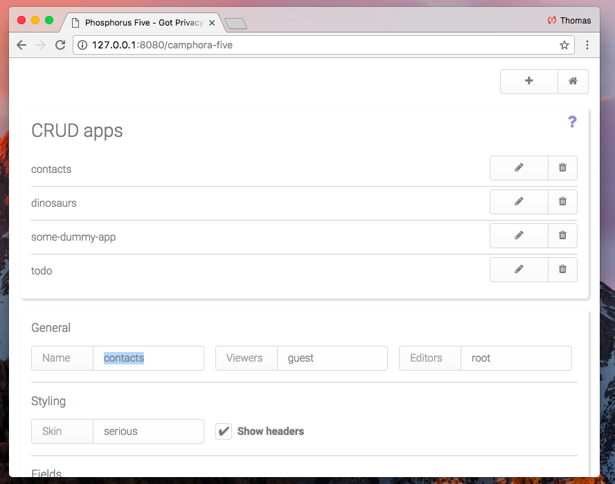
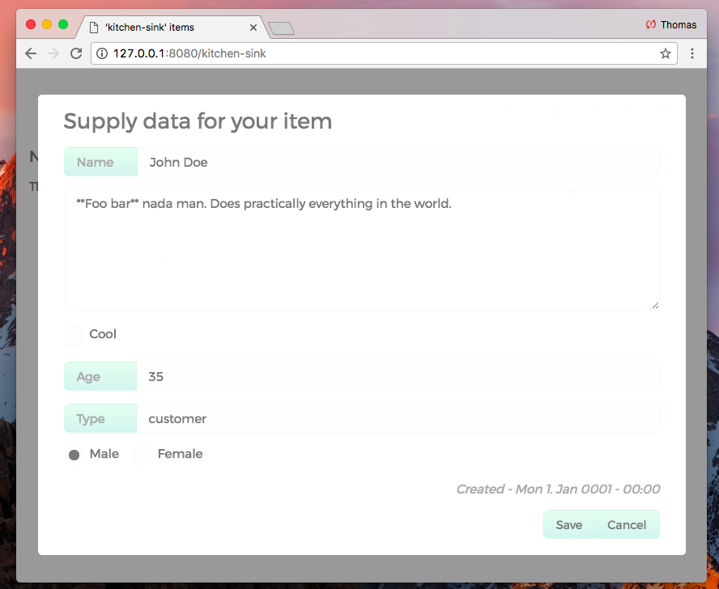
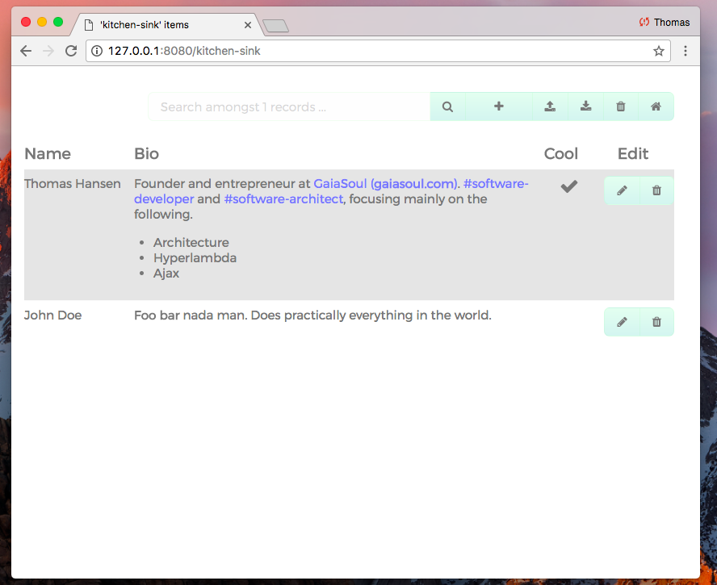

# Permanently solving the "CRUD problem"

Since the general theme of our book so far, have been the creation of CRUD app, we're going to permanently solve that problem, by creating an app, that allows anyone, to create any CRUD apps they wish - While storing the data in a _"real"_ database - MySQL that is.

## Meet Camphora Five

Below is a screenshot of [Camphora Five](https://github.com/polterguy/camphora-five), which allows us to do just that.

In the above screenshot, I have created 4 different CRUD apps. As you create a CRUD app in Camphora Five, you can declare as many (or as few) columns as you wish, and you can choose which underlaying data type each column should have. The latter decides how items in your form are being edited, among other things.

## Architecture

Creating a fully fledged app like Camphora Five, which allows anyone to create their own apps, by going through a wizard form - Is simply not fit for the format of this book. Hence, instead of showing you every single line of code, I will walk through Camphora's architecture, from an abstract point of view - And the design decisions I made, as I created it.

First of all, I wanted users to be able to create _real apps_, and not rely upon generic templates too much. This allows you to modify an existing app, after you have created it, to create additional features in your app. Hence, what I do, as you generate your apps in Camphora, is actually to create a complete _"/modules/"_ folder for your app, containing the app, as you chose to create it.

This implies that after you have created a Camphora app, you've got a pretty nice starting ground, for modifying your app, to create additional features, using Hyperlambda as we've gone through it, from within this book.

Each app you create will hence have its own folder, with lots of Hyperlambda files within, which you can edit as you see fit. These files and folders can be found in the _"/template/"_ folder of Camphora Five's source code.

## Features

In addition to crearting a _real app_, I wanted its resulting apps to be as versatile as possible. For instance, if you choose to create a _"textarea"_ column type, the user punching in data for its items, can add __#hash-tags__ to categorize items, in addition to using Markdown, to format the content. This allows you to have items with images, basic HTML formatting, in addition to easily categorize your items using hash tags.

There are many different column types in Camphora, which decides how the underlaying data item is treated, both in the database, and as you edit the item. This allows a user of Camphora to create most column types he would need, allowing to have items which are of type _"checkbox"_, _"date created"_, in addition to radio buttons and select dropdown lists. See the screenshot below for a _"kitchen sink"_ example of an app created with Camphora.

As you browse your items, the above will look like the following. Notice, I have explicitly chosen to not show all columns as I am viewing the items in _"grid mode"_. Also notice the clickable __#hash-tags__, which you can click, to filter away all items not being tagged with the specified hash tag.

## Installation

The easiest way to install Camphora Five, is actually to [install Phosphorus Five](https://github.com/polterguy/phosphorusfive/releases) in for instance a Linux server, for then to visit the _"Bazar"_, and purchase Camphora Five. You can of course download the source code yourself, and simply put your unzipped _"camphora-five"_ folder inside of your _"/modules/"_ folder - But since you anyways need a [proprietary license](https://gaiasoul.com/license) to create proprietary apps in Phosphorus Five - You might as well purchase one now, since you'll need it if you wish to use Camphora to create and distribute proprietary apps anyways.
