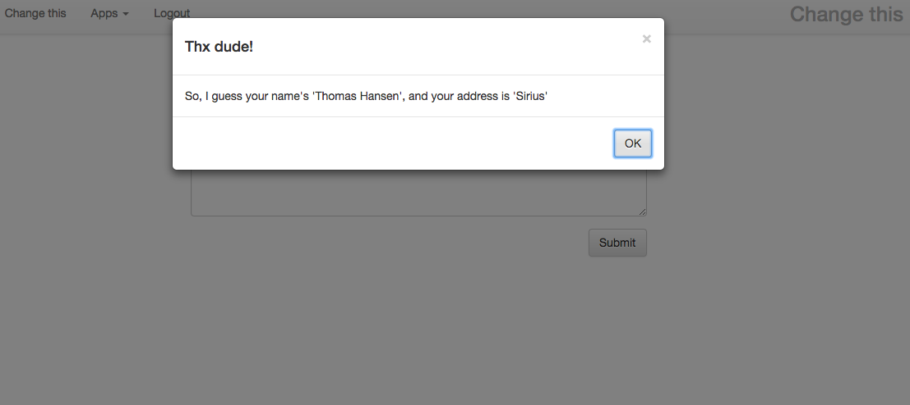

# Your first Ajax form

Probably among your most important tasks in an Ajax application, is the gathering of data from your users. This is easily done with P5. Below is an example.

```
create-widget
  parent:content
  class:col-xs-6 col-xs-push-3 text-right
  widgets
    void:your_name
      element:input
      placeholder:Give me your name ...
      class:form-control
    literal:your_adr
      element:textarea
      placeholder:Give me your address ...
      class:form-control prepend-top
      rows:7
    literal
      element:button
      class:btn btn-default prepend-top
      innerValue:Submit
      onclick
        p5.web.widgets.property.get:your_name
          value
        p5.web.widgets.property.get:your_adr
          value
        eval-x:x:/+/*/body
        sys42.windows.confirm
          header:Thx dude!
          body:So, I guess your name's '{0}', and your address is '{1}'
            :x:/../*/p5.web.widgets.property.get/*/your_name/*?value
            :x:/../*/p5.web.widgets.property.get/*/your_adr/*?value
```

There are several new concepts in the above piece of Hyperlambda, let's walk through them all, to get a grasp of exactly what is going on here.

First of all, we don't care about giving neither or main root **[container]** widget, nor our button widget any explicit IDs. This ensures, as we've previously discussed, in that our widgets will have an *"automatic ID"* assigned to them. You can see this ID if you choose to view the HTML of your page.

Secondly, we create a simple *"input"* element, followed by a *"textarea"* element. Both of these widgets, we give an explicit ID, since we want to be able to easily retrieve their values later. This also helps your browser to *"semantically understand"* what it is looking at, which might play a role during autocompletion of forms, and such. Notice how the *"input"* element is created as a **[void]** widget, while our *"textarea"* element is created as a **[literal]** widget. As we previously discussed, this is important for these particular types of HTML elements.

The CSS class `class:col-xs-6 col-xs-push-3 text-right`, that we declared as arguments for our main **[create-widget]** node, simply makes sure our form is centered on the screen, consuming half its available width, and right aligns our button further down in its **[widgets]** collection. The *"prepend-top"* parts of the CSS classes of the textarea and our button, simply gives us some additional room between our widgets, such that we can apply some spacing between our widgets, to avoid having them cluttered together, reducing readability. The *"form-control"* CSS classes, are from [Bootstrap CSS](http://getbootstrap.com/css/). In fact, so are most of the CSS classes used in the above example.

## Retrieving form data

Probably the most complex parts above, is the stuff that's happening in our **[onclick]** event handler. To ease the understanding of it, let's isolate the Hyperlambda of our **[onclick]** Ajax event, and closely examine it.

```
onclick
  p5.web.widgets.property.get:your_name
    value
  p5.web.widgets.property.get:your_adr
    value
  eval-x:x:/+/*/body
  sys42.windows.confirm
    header:Thx dude!
    body:So, I guess your name's '{0}', and your address is '{1}'
      :x:/../*/p5.web.widgets.property.get/*/your_name/*?value
      :x:/../*/p5.web.widgets.property.get/*/your_adr/*?value
```

Initially we retrieve the values of our *"your_name"* input element, and our *"your_adr"* textarea element. Then we show a modal confirmation window, with the data supplied by the user of our application. However, before we show this modal confirmation window, there's an invocation to `eval-x`. This simply *"forward evaluates"* the expressions found in our **[body]** node. Since this is a formatted string, with its formatting values pointing to the results of our **[p5.web.widgets.property.get]** invocations, this means that when **[sys42.windows.confirm]** executes, its **[body]** argument will be a static string, being the product of our formatting expressions, having its *"{n}"* parts, exchanged with its n'th child node's result.

The above `:x:` parts of our Hyperlambda, are in fact what we refer to as *"lambda expressions"* These allows you to reference other nodes in your lambda structure. If you have some knowledge of XPath, the similarities might be obvious.

The invocation to **[sys42.windows.confirm]**, simply creates a modal Ajax confirmation window for us. This Active Event expects the arguments **[header]** and **[body]**. All in all, this should result in something resembling what the image below shows us.


